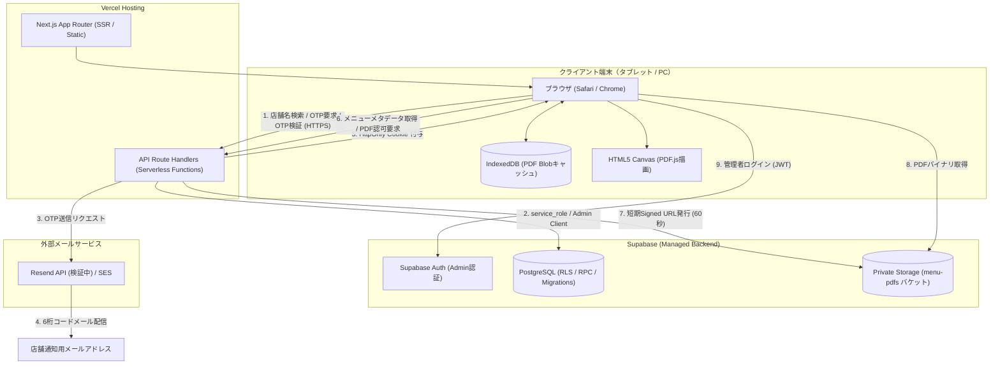

# ARCHITECTURE.md — システム基本設計・アーキテクチャ

> **Status**: CURRENT  
> **Last Updated**: 2026-09-24  

---

## 1. 全体アーキテクチャ構成

本システムは、モダンなJamstack / サーバーレスWebアーキテクチャ（Next.js App Router + Vercel + Supabase）を採用しています。

---

## 2. 環境分離方針（Production vs Preview vs Local）

本番と検証の誤操作・データ混入を防ぐため、インフラレベルで厳格に分離しています。

| レイヤー | Verification (検証環境) | Production (本番環境) | Local Development |
|---|---|---|---|
| **Vercel** | Preview / 固定エイリアス (`insou-menu-verification.vercel.app`) | Production (`insou-menu-system.vercel.app`) | `localhost:3000` |
| **Supabase** | `cqlddcxvanwoxpaouzow` (専用プロジェクト) | `yzvencvfkltxehcjpgol` (本番専用プロジェクト) | VerificationまたはLocal |
| **DBデータ** | テスト店舗・テストPDF・検証用ログ | 実店舗・本番メニュー（公開前） | 検証用データのみ参照 |
| **環境変数** | `.env.verification.local` (Vercel Preview) | Vercel Production Environment Variables | `.env.local` |
| **メール** | Resend (テストドメイン) | INSOU承認済み本番メール基盤 | モック / スキップ |

> **重要原則**:
> - Vercel PreviewからProduction Supabaseへの接続は禁止。
> - ローカル環境からProduction Supabaseへの直接接続は禁止。

---

## 3. 主要サブシステムと通信仕様

### 3.1 店舗端末認証サブシステム (`app/api/store-auth/`)
- **Cookie設計**:
  - クッキー名: `insou_store_session`
  - 属性: `HttpOnly`, `Secure`, `SameSite=Lax`, `Path=/`, `Max-Age=2592000` (30日)
  - 内容: ランダムトークン平文（サーバーの `store_device_sessions.token_hash` と照合）
- **セッション検証フロー**:
  1. API呼び出し時にCookieヘッダーからトークンを取得。
  2. SHA-256でハッシュ化し、`store_device_sessions` の有効行を検索。
  3. 店舗の `device_session_version` とセッションの `session_version` が一致するか検証。
  4. 有効であれば `last_accessed_at` を更新し、リクエストを続行。不一致または失効時は401 (`clearCache: true`) を返却。

### 3.2 PDF配信・キャッシュ同期サブシステム
- **同期ロジック (`lib/pdf-cache.ts`)**:
  - メニューIDと更新日時 (`id:pdf_updated_at`) をキーとしてIndexedDB内のBlobを検索。
  - キャッシュが存在すればネットワーク通信をスキップ。
  - キャッシュがない場合のみ、`/api/store-auth/pdf/[id]` から60秒有効なSupabase Storage Signed URLを取得し、バイナリを取得してIndexedDBへ格納。
- **完全オフライン禁止ゲート**:
  - `navigator.onLine` がfalse、またはサーバーへのセッション検証APIが疎通不能な場合、PDFの初期化・描画処理を開始しない。

### 3.3 管理者バックエンドサブシステム (`app/api/admin/`)
- **認可チェック**:
  - 各APIハンドラーの冒頭でSupabase AuthのBearer JWTを検証。
  - `user_profiles.role = 'admin'` を確認したリクエストのみ、`getSupabaseAdminClient()`（`SUPABASE_SECRET_KEY` 使用）による特権操作を許可。
  - 一般ユーザーや未認証リクエストは401/403で拒否。

---

## 4. レガシー構成の取り扱い（Legacy / Deprecated）

以下の構成は旧MVP（試作）時代の遺物であり、**現行の正式システムでは完全廃止（非推奨）** となっています。

- **Google Apps Script (GAS) / Spreadsheet**:
  - ディレクトリ `gas/` およびファイル `lib/gas-api.ts` は、移行元の初期参考実装としてのみ保管されています。フロントエンドおよびAPIからは一切呼び出されません。
- **Google Drive 保存 & Base64 JSON 配信**:
  - PDFをBase64文字列に変換してHTTPレスポンスに含める方式は廃止されました。現在はSupabase Private Storageからのバイナリストリーミング方式となっています。
- **店舗固定パスワード認証**:
  - `ks-01@stores.insou.internal` などのダミーメールと固定パスワードを用いたSupabase Auth直接ログインは廃止されました。現在はOTP認証＋端末セッション方式へ移行しています。
