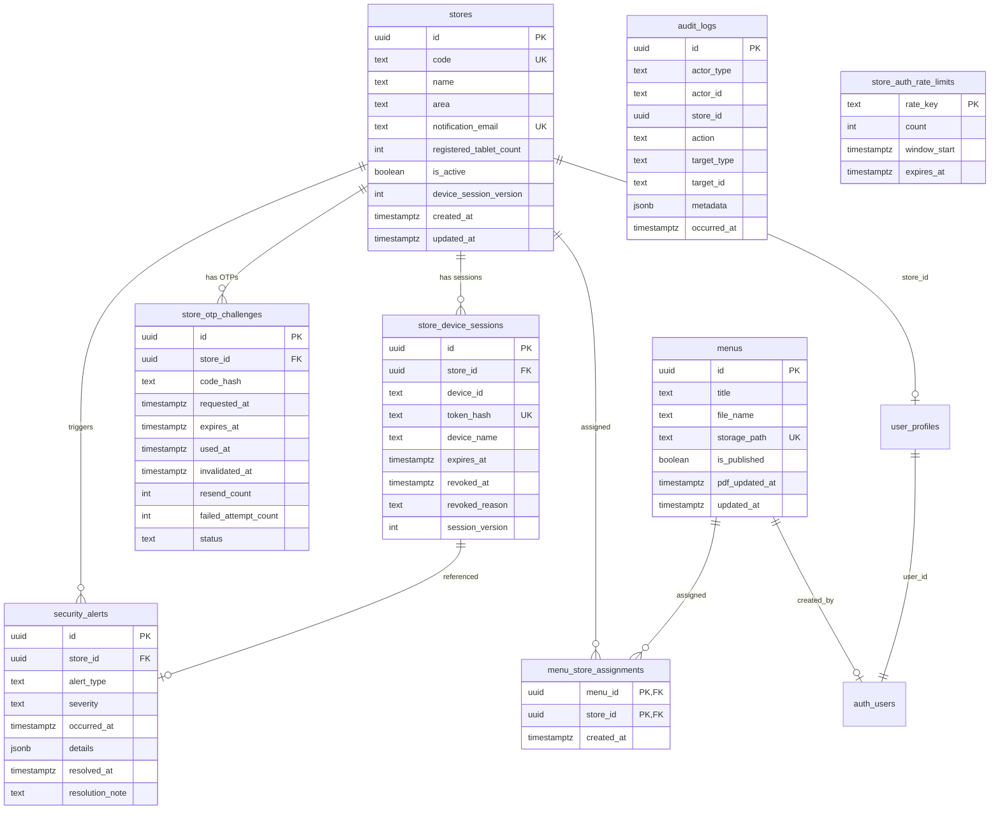

# DATABASE.md — データベース仕様書

> **Status**: CURRENT  
> **Last Updated**: 2026-09-24  
> **Source of Truth**: `supabase/migrations/` 配下のSQLファイル  

本書は、Supabase PostgreSQLデータベースの**現在有効なスキーマ、テーブル、関数（RPC）、およびセキュリティポリシー（RLS）** を説明する仕様書です。

---

## 1. テーブル一覧とER概要

---

## 2. 主要テーブル定義詳細

### 2.1 `stores`（店舗マスター）
店舗の基本情報および端末管理パラメータを保持。
- `id` (uuid, PK): 店舗ID
- `code` (text, UK): 店舗コード（大文字強制、例: `KS-01`）
- `name` (text): 店舗名
- `area` (text): エリア名（大阪、北新地等）
- `notification_email` (text): OTP送信先メールアドレス。大文字小文字無視の一意インデックスあり (`lower(trim(notification_email))`)
- `registered_tablet_count` (integer): 契約・登録タブレット台数。NULL許容
- `is_active` (boolean): 有効フラグ（false時は検索・OTP要求不可）
- `device_session_version` (integer): 店舗全端末一括ログアウト用のバージョンカウンター（デフォルト1）

### 2.2 `store_otp_challenges`（ワンタイムパスコード）
店舗からのログイン認証要求を一時保持。
- `id` (uuid, PK): challenge_id
- `store_id` (uuid, FK): 対象店舗
- `code_hash` (text): `HMAC-SHA256(challenge_id + ":" + OTP, secret)`
- `expires_at` (timestamptz): 有効期限（発行から15分）
- `resend_count` (integer): 再送回数カウント
- `failed_attempt_count` (integer): 入力失敗回数（最大5回で `locked`）
- `status` (text): `issued`, `used`, `expired`, `invalidated`, `locked`

### 2.3 `store_device_sessions`（30日端末セッション）
OTP検証成功後に端末へ付与されるセッション。
- `id` (uuid, PK): セッションUUID
- `store_id` (uuid, FK): 店舗ID
- `device_id` (text): クライアント生成の端末識別子
- `token_hash` (text, UK): Cookie内生トークンのSHA-256ハッシュ
- `device_name` (text): 端末表示名
- `expires_at` (timestamptz): セッション有効期限（発行から30日）
- `revoked_at` (timestamptz): 失効日時（NULLなら有効）
- `revoked_reason` (text): 失効理由
- `session_version` (integer): 発行時点の店舗 `device_session_version`

### 2.4 `menus` & `menu_store_assignments`（メニュー配信）
- `menus.storage_path`: Supabase Private Storage内のファイルパス（例: `menus/uuid.pdf`）
- `menus.pdf_updated_at`: PDF本体が差し替えられた日時（IndexedDB差分同期判定キー）
- `menu_store_assignments`: メニューと配信対象店舗の多対多リレーションテーブル

### 2.5 `security_alerts` & `audit_logs`
- `security_alerts`: 台数不一致や不審アクセスを記録。管理者が解決可能。
- `audit_logs`: 管理者・店舗の操作ログ。OTP平文・パスワード等の秘密情報は保存厳禁。

### 2.6 `store_auth_rate_limits`
Vercelの複数インスタンス環境で安全に共有される永続化レートリミッターテーブル。

---

## 3. 主要ストアドファンクション（RPC）

| 関数名 | 役割 | 権限 / 特徴 |
|---|---|---|
| `create_store_otp_challenge(p_challenge_id, p_store_id, p_code_hash, p_expires_in)` | OTPを発行し、同一店舗の既存未完了OTPを自動無効化 | SECURITY DEFINER (service_role専用) |
| `verify_store_otp(p_challenge_id, p_code_hash, p_max_attempts)` | アトミックにコード検証、失敗カウント増加、ロック判定を実施 | SECURITY DEFINER (service_role専用) |
| `create_store_device_session(p_store_id, p_device_id, p_token_hash, p_device_name, p_expires_in)` | 30日端末セッションを作成 | SECURITY DEFINER (service_role専用) |
| `revoke_store_device_session(p_session_id, p_reason)` | 個別端末セッションを失効 | SECURITY DEFINER (service_role専用) |
| `revoke_all_store_device_sessions(p_store_id, p_reason)` | 店舗の `device_session_version` を+1し全端末を一括失効 | SECURITY DEFINER (service_role専用) |
| `reconcile_store_tablet_count(p_store_id)` | 有効端末数と登録台数を比較し、差分アラートを自動起票／解決 | SECURITY DEFINER (service_role専用) |
| `check_and_increment_rate_limit(p_rate_key, p_limit, p_window_seconds)` | 原子的カウンター更新によるレート制限判定 | SECURITY DEFINER (service_role専用) |

---

## 4. 行レベルセキュリティ（RLS）方針

すべてのテーブルおよびストレージオブジェクトでRLSを有効化（`ENABLE ROW LEVEL SECURITY`）しています。

- **店舗端末（ブラウザ匿名 / Cookieアクセス）**:
  - テーブルへ直接SQLを発行させず、Next.js API Route Handler経由でアクセス。
  - DBへの直接問い合わせ（anon key使用時）はRLSによりすべてブロック。
- **管理者（Supabase Auth JWT `role = 'admin'`）**:
  - `stores`, `menus`, `user_profiles`, `menu_store_assignments` へのSELECT/INSERT/UPDATE/DELETE権限。
- **特権操作（service_role）**:
  - OTP生成・セッション管理・失効処理などの機微関数は、パブリックEXECUTE権限を剥奪（`REVOKE ALL ... FROM public, anon, authenticated`）し、サーバー側の `SUPABASE_SECRET_KEY` からのみ実行可能。
